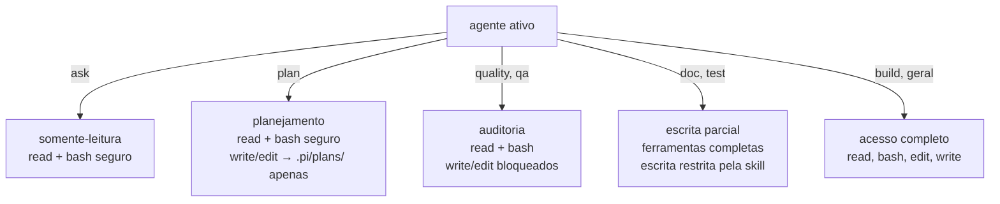
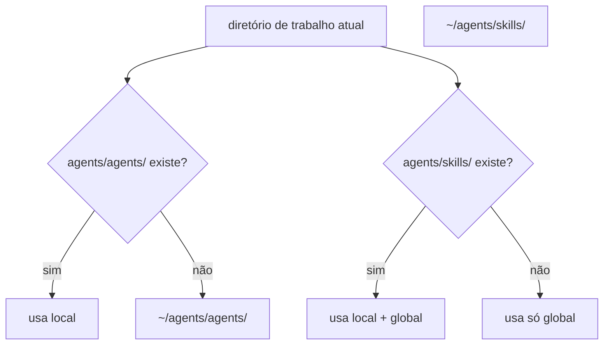

# Agentes e Skills

Os agentes ficam em `agents/agents/` e as skills de suporte em `agents/skills/`. Cada um é um diretório com um arquivo `SKILL.md` contendo frontmatter YAML e instruções em Markdown.

O `agent-switcher` carrega os agentes automaticamente e o `agents-resolver` os registra no pi para descoberta nativa.

---

## Agentes

Troque de agente com **Alt+A** (ciclo) ou **`/agent`** (seletor visual).

| Agente | Modo | Descrição |
|---|---|---|
| `ask` | somente-leitura | Responde perguntas sobre o projeto sem modificar nada |
| `build` | escrita completa | Implementa funcionalidades, corrige bugs e refatora |
| `doc` | escrita em `docs/` | Cria e atualiza ADRs, tabelas de API, diagramas Mermaid |
| `geral` | escrita completa | Propósito geral sem restrições de domínio |
| `plan` | escrita em `.pi/plans/` | Planeja funcionalidades antes de implementar |
| `qa` | auditoria | Analisa bugs, edge cases e vulnerabilidades de segurança |
| `quality` | auditoria | Verifica conformidade com lint, tipos e convenções do projeto |
| `test` | escrita em `tests/` | Cria, mantém e executa testes automatizados |

### Modos de permissão

### Quando usar cada agente

| Situação | Agente recomendado |
|---|---|
| "O que faz esse módulo?" / "Como funciona X?" | `ask` |
| Implementar funcionalidade, corrigir bug, refatorar | `build` |
| Quero um plano antes de começar a implementar | `plan` |
| Meu código tem bugs ou brechas de segurança? | `qa` |
| Meu código segue as convenções do projeto? | `quality` |
| Criar ou atualizar documentação técnica | `doc` |
| Criar ou atualizar testes automatizados | `test` |
| Qualquer outra coisa | `geral` |

---

## Skills

Skills são carregadas sob demanda com `/skill:nome` e fornecem instruções especializadas ao agente ativo para uma tarefa específica.

| Skill | Descrição |
|---|---|
| `diagram` | Cria e valida diagramas Excalidraw — C4, ER, fluxos, árvores de componentes |
| `doc-architecture` | ADRs (formato MADR compacto) e tabelas de inventário de serviços |
| `doc-backend` | Tabelas de endpoints, fluxos de dados e quando escrever ADRs |
| `doc-db` | Diagramas ER em três níveis de detalhe (conceitual, lógico, físico) |
| `doc-frontend` | Tabelas de componentes, rotas, estado global e fluxos de usuário |
| `excalidraw` | Geração de JSON Excalidraw para visualizações e arquiteturas |
| `git-commit-push` | Commit Conventional Commits, push e abertura de PR no GitHub |

### Resolução local vs global

> **Agentes:** o diretório local substitui o global — projetos com `agents/agents/` próprio têm seus agentes priorizados.  
> **Skills:** local e global são combinados — as skills do projeto ficam disponíveis junto com as deste repositório.
