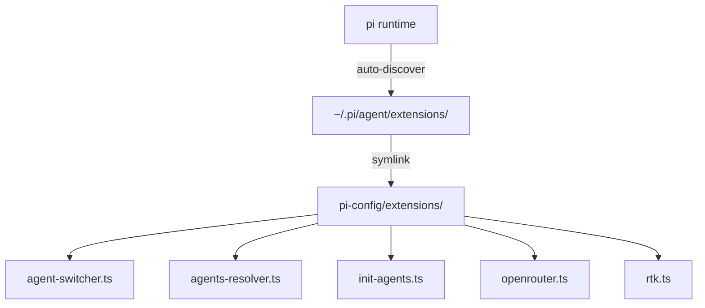
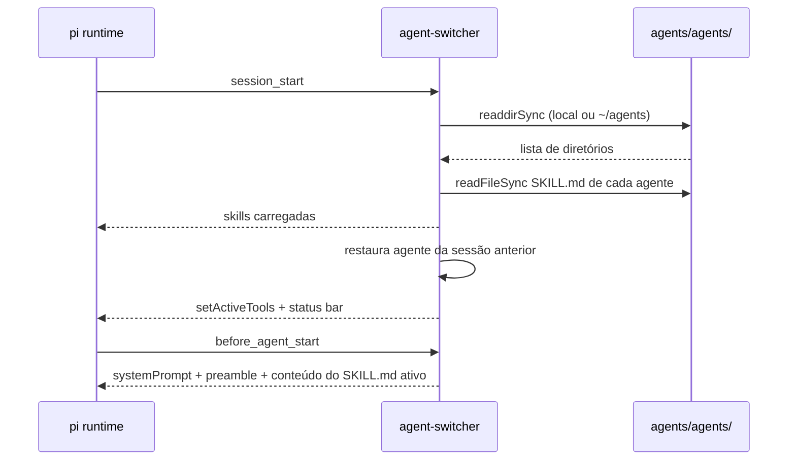
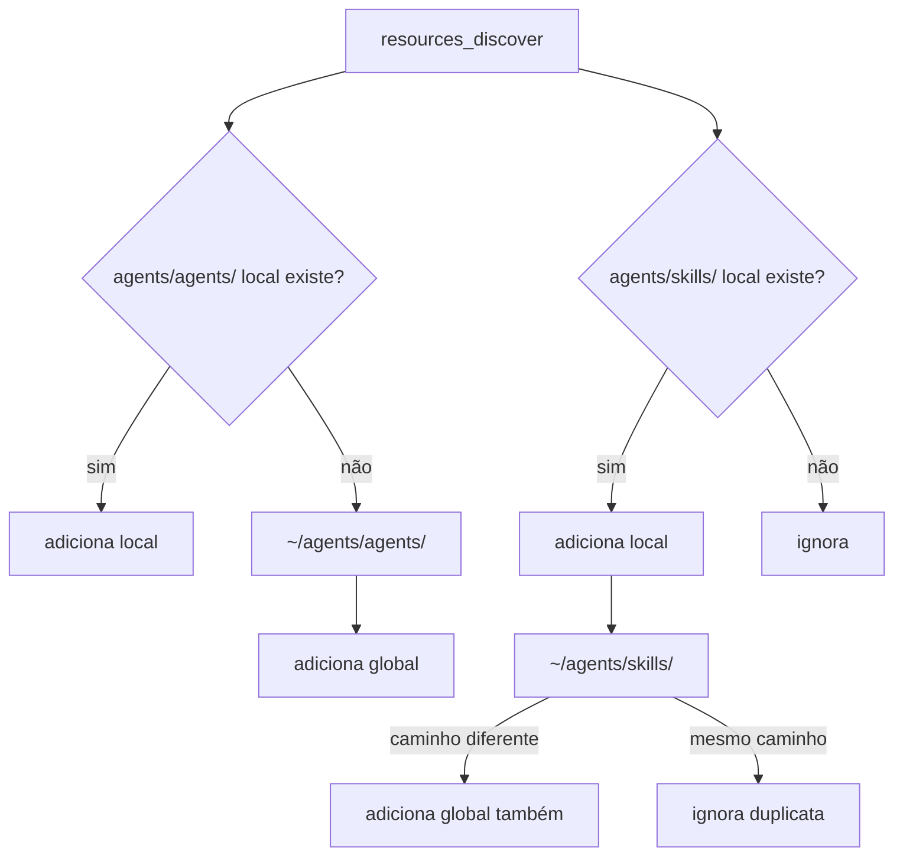
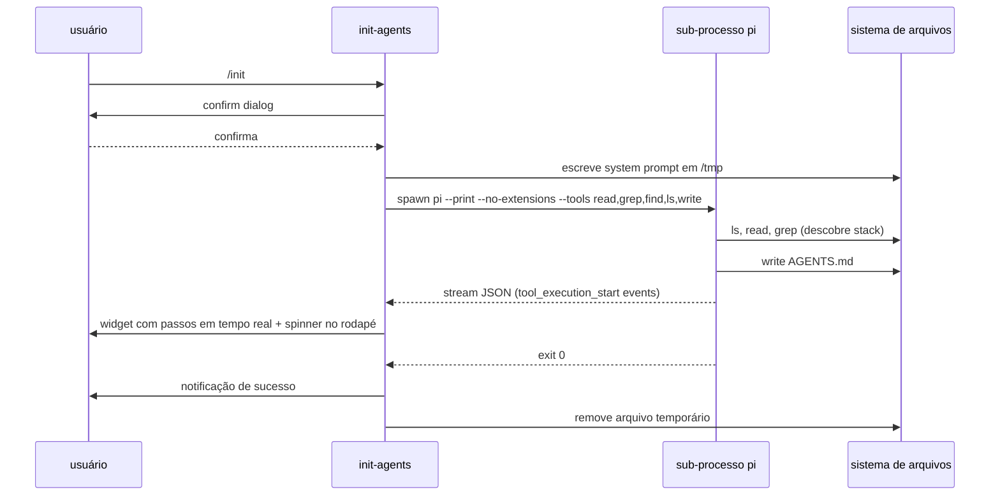
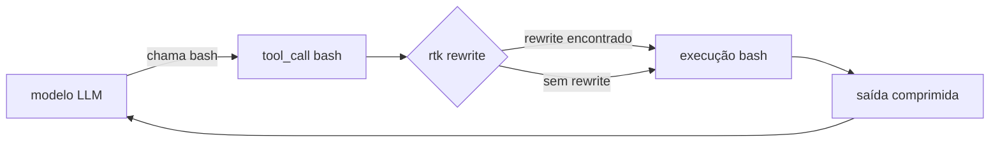

# Extensões

As extensões ficam em `extensions/` na raiz do repositório e são carregadas pelo pi via symlink em `~/.pi/agent/extensions/`. Cada arquivo exporta `default function(pi: ExtensionAPI)` e é carregado pelo pi em runtime via `jiti` — sem etapa de compilação.



---

## agent-switcher

Carrega os agentes disponíveis em `agents/agents/` e permite alternar entre eles. Controla as ferramentas ativas conforme o modo de cada agente e injeta o conteúdo do `SKILL.md` ativo no system prompt antes de cada turno.

### Comandos e atalhos

| Atalho / Comando | Ação |
|---|---|
| `Alt+A` | Cicla para o próximo agente |
| `/agent` | Abre seletor visual com lista e descrições |
| `/agent-reload` | Recarrega os SKILL.md sem reiniciar o pi |

### Modos de permissão

| Modo | Agentes | Ferramentas liberadas |
|---|---|---|
| Somente-leitura | `ask` | `read`, `grep`, `find`, `ls` + bash seguro |
| Planejamento | `plan` | Igual + `write`/`edit` apenas em `.pi/plans/` |
| Auditoria | `quality`, `qa` | `read`, `bash`, `grep`, `find`, `ls` |
| Escrita parcial | `doc`, `test` | Todas — escrita restrita pela própria skill |
| Acesso completo | `build`, `geral` | `read`, `bash`, `edit`, `write` |

> Bash seguro: `ls`, `find`, `grep`, `cat`, `head`, `tail`, `git log`, `git diff`, `git status`, `git show`, `jq`, entre outros comandos de leitura.

### Fluxo de inicialização



### Resolução de agentes (local vs global)

O switcher busca por `agents/agents/` no diretório de trabalho atual. Se não existir, usa `~/agents/agents/` (que aponta para este repositório via symlink).

---

## agents-resolver

Registra os caminhos de agentes e skills no evento `resources_discover` do pi, tornando-os descobríveis pelos mecanismos nativos (seletor `/agent`, `/skill:nome`).

### Lógica de resolução



> **Agentes:** local tem prioridade; global é fallback.  
> **Skills:** local e global são adicionados juntos (quando diferentes).

---

## init-agents

Registra o comando `/init`, que spawna um sub-processo pi no modo `--print --no-extensions` com um system prompt específico. O sub-agente analisa o projeto e escreve o `AGENTS.md` autonomamente.

### Fluxo do `/init`



### Ferramentas do sub-agente

O sub-agente recebe apenas: `read`, `grep`, `find`, `ls`, `write`. Não tem acesso a `bash` nem às extensões do pi principal.

---

## openrouter

Registra o provedor `openrouter` no pi com a API compatível com OpenAI Completions. A API key é lida dinamicamente a cada chamada:

1. Busca `OPENROUTER_API_KEY` no `.env` da raiz do repositório atual (`git rev-parse --show-toplevel`)
2. Fallback para a variável de ambiente `OPENROUTER_API_KEY`

### Modelos registrados

| ID | Nome | Contexto | Custo |
|---|---|---|---|
| `qwen/qwen3.6-plus:free` | Qwen 3.6-plus via OpenRouter | 40.960 tokens | gratuito |

> Para adicionar modelos, edite `extensions/openrouter.ts` e inclua novos objetos no array `models`.

---

## rtk

Integra o [RTK (Rust Token Killer)](https://www.rtk-ai.app/) para reduzir o consumo de tokens nas saídas de comandos bash. Intercepta chamadas de ferramentas antes da execução e substitui `grep`, `find` e `ls` por versões comprimidas.

> O `read` nativo do pi é preservado intencionalmente — o RTK trunca arquivos de forma opaca e prejudica a qualidade do agente em arquivos grandes.

### Funcionamento



Para `grep`, `find` e `ls`, as ferramentas são substituídas por implementações próprias que chamam `rtk grep`, `rtk find` e `rtk ls` diretamente.

### Comandos

| Comando | Ação |
|---|---|
| `/rtk-reload` | Re-verifica se o binário `rtk` está no PATH e recarrega o pi |
| `/rtk-logs` | Exibe economia de tokens da sessão atual e estatísticas globais |

### Instalação do binário

```bash
# macOS
brew install rtk

# Linux
curl -fsSL https://raw.githubusercontent.com/rtk-ai/rtk/master/install.sh | sh
```
